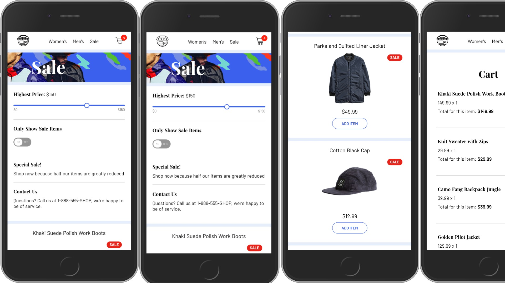

# Angular Shop

This project was generated with [Angular CLI](https://github.com/angular/angular-cli) version 7.3.0.

This small project demos an ecommerce application setup with Angular, using local data(could be replaced with a remote data source).



[](https://app.netlify.com/sites/angular-shop/deploys)

## Build Setup

```bash
# install dependencies
$ npm install

# serve with hot reload at localhost
$ ng serve

# build for production
$ ng build --prod
```

## Todo

- Add logic for duplicate cart items
- Migrate to remote data source
- Integrate payment

## License

    Copyright 2019 Precious Keyz

    Licensed under the Apache License, Version 2.0 (the "License");
    you may not use this file except in compliance with the License.
    You may obtain a copy of the License at

    http://www.apache.org/licenses/LICENSE-2.0

    Unless required by applicable law or agreed to in writing, software
    distributed under the License is distributed on an "AS IS" BASIS,
    WITHOUT WARRANTIES OR CONDITIONS OF ANY KIND, either express or implied.
    See the License for the specific language governing permissions and
    limitations under the License.

## Disclaimer

- CSS stylesheet was taken from [https://github.com/sdras/sample-vue-shop](https://github.com/sdras/sample-vue-shop)
- i do not have any affiliation with person's afore mentioned.
